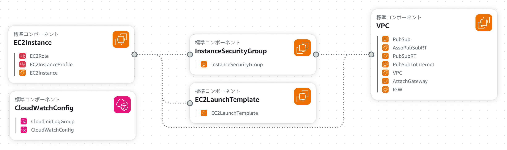

# AWS リソース定義

## 環境構成

### アーキテクチャ概要

```text
[ユーザ] --SSH--> [クライアントEC2（最小IAM権限）]
                      |
                      | 起動時: systemd ExecStart
                      | 停止時: systemd ExecStop（シャットダウンをブロック）
                      | batch:SubmitJob
                      v
               [AWS Batch JobQueue]
                      |
                      v
          [eksctl-runner コンテナ (Fargate)]
            EksctlTaskRole（EKS操作の強権限）
            SSMからclusterconfig取得 → eksctl create/delete cluster
```

#### IAM権限の分離

EKSクラスターの作成・削除に必要な強い権限（`eks:*`、`AmazonEC2FullAccess`、`AWSCloudFormationFullAccess`）は、EC2インスタンスのIAMロールには付与せず、Fargateコンテナ（`EksctlTaskRole`）のみに付与する。

EC2のIAMロールは以下の最小権限のみ保持する。

- `eks:DescribeCluster` — `aws eks update-kubeconfig` 用
- `batch:SubmitJob` / `batch:DescribeJobs` — EKSライフサイクルジョブの送信・監視用

#### EKSライフサイクルの自動化

`eksctl-lifecycle.service`（systemd）により、EC2の起動・停止に連動してEKSクラスターを自動管理する。

| タイミング | 動作 |
| --- | --- |
| EC2起動時 | `ExecStart`: EKSクラスター作成ジョブをBatchに送信し、完了まで待機 |
| EC2停止時 | `ExecStop`: EKSクラスター削除ジョブをBatchに送信し、完了まで待機してからシャットダウン継続 |

`RemainAfterExit=yes` により、EKS作成が失敗した場合はシャットダウン時の削除ジョブは実行されない。

### CloudFormation template

テンプレートファイル: [ec2-eksctl-ubuntu.yaml](ec2-eksctl-ubuntu.yaml)

下記のリソース群を管理する



### 参考

- [eksctl公式ドキュメント](https://eksctl.io/)
